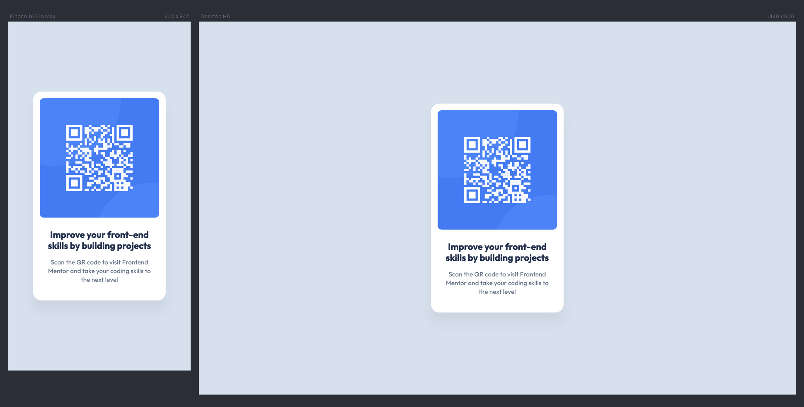

# QR code component

This is a solution to the [QR code component challenge on Frontend Mentor](https://www.frontendmentor.io/challenges/qr-code-component-iux_sIO_H). Frontend Mentor challenges help you improve your
coding skills by building realistic projects.

## 💪 Challenge

Your challenge is to build out this QR code component and get it looking as close to the design as possible.

### 💡 Ideas to test yourself

- Focus on writing semantic HTML and using the correct elements based on the content.

## 📸 Screenshots

## 🔗 Links

&nbsp;&nbsp;
&nbsp;&nbsp;

## 👷🏻‍♀️ Built with

- Semantic HTML
- [New Reset CSS](https://elad2412.github.io/the-new-css-reset)
- CSS Variables
- Flexbox

## 👩🏻‍💻 Author

&nbsp;&nbsp;
&nbsp;&nbsp;

