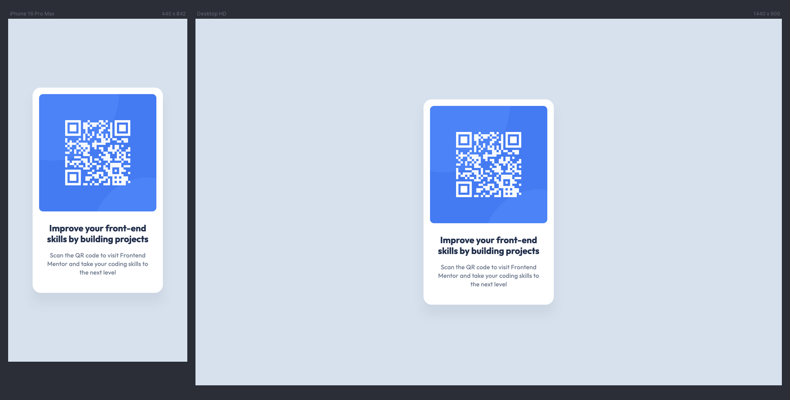

# Frontend Mentor - QR code component

This is my solution to the [QR code component challenge on Frontend Mentor](https://www.frontendmentor.io/challenges/qr-code-component-iux_sIO_H).

## 📸 Screenshots

## 🔗 Links

&nbsp;&nbsp;
&nbsp;&nbsp;

## 👷🏻‍♀️ Built with

- HTML/CSS
- CSS Variables
- Flexbox

## 👩🏻‍💻 Author

&nbsp;&nbsp;
&nbsp;&nbsp;

