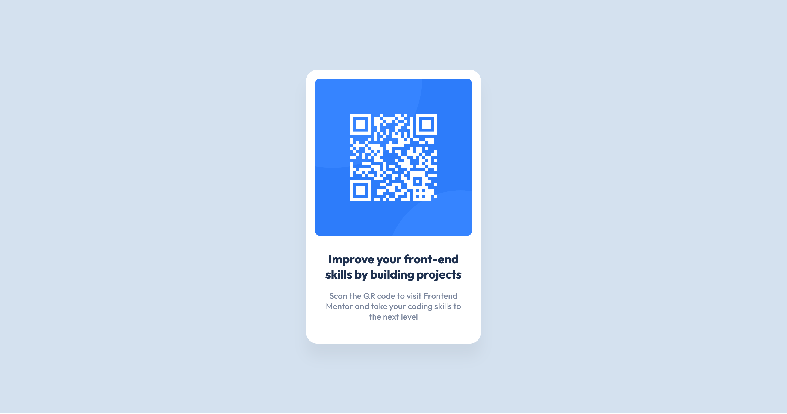

# QR Code Component

This is a solution to the
[QR Code Component](https://www.frontendmentor.io/challenges/qr-code-component-iux_sIO_H)
challenge on [Frontend Mentor](https://www.frontendmentor.io)

## 💪 Challenge

Create a QR Code Component and style it according to the provided design specifications.
The goal is to replicate the design as closely as possible, ensuring that the component is
visually appealing and functions well across different devices and screen sizes.

## 📸 Screenshots

### 🖥️ Desktop

### 📱 Mobile

## 🔗 Links

&nbsp;&nbsp;

&nbsp;&nbsp;

## 🛠️ Built with

- Semantic HTML
- CSS Variables
- Flexbox
- `reset.css`

## 👩🏻‍🎓 What I learned

<dl>
  <dt >Centering Elements:</dt>
  <dd>
    Flexbox is generally preferred for centering elements on a page, as CSS
    Grid's place-items: center can sometimes lead to overflow issues when users
    increase their font size.
  </dd>
  <dt>Importing Fonts and CSS:</dt>
  <dd>
    Directly importing fonts and CSS into HTML is generally not recommended.
    It's considered best practice to use separate files (CSS for styles, font
    files for fonts) and link them to your HTML. This improves maintainability,
    organization, and performance.
  </dd>
</dl>

## 👍🏻 Useful resources

- Modern [reset.css](https://elad2412.github.io/the-new-css-reset/)
- [Frontend Mentor](https://frontendmentor.io)

## 💻 Author

&nbsp;&nbsp;

&nbsp;&nbsp;

